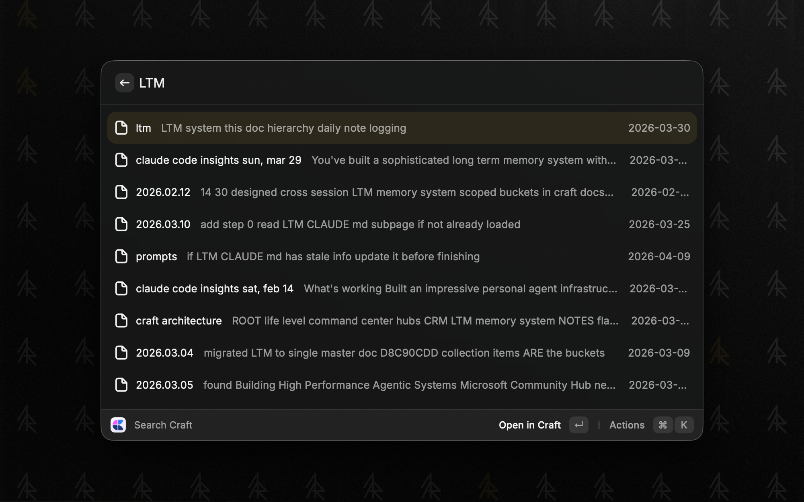
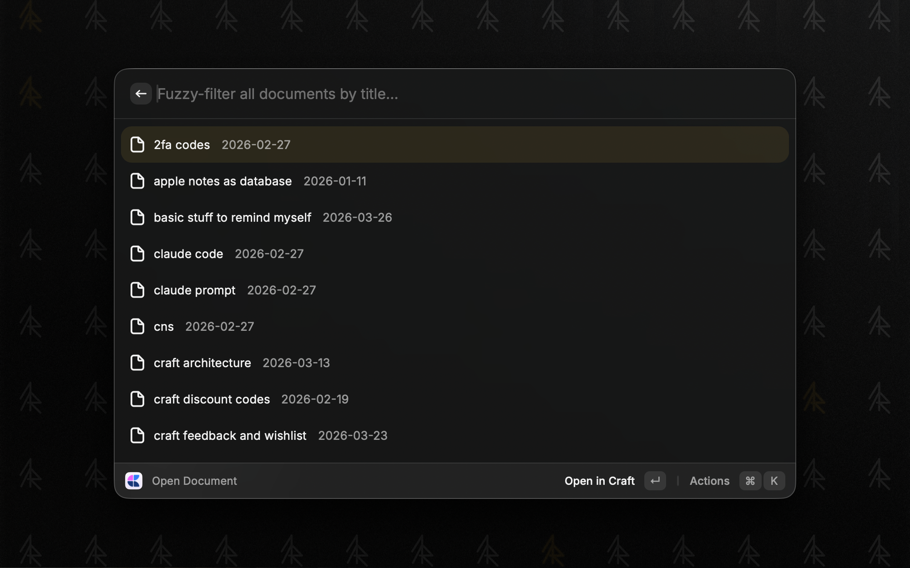
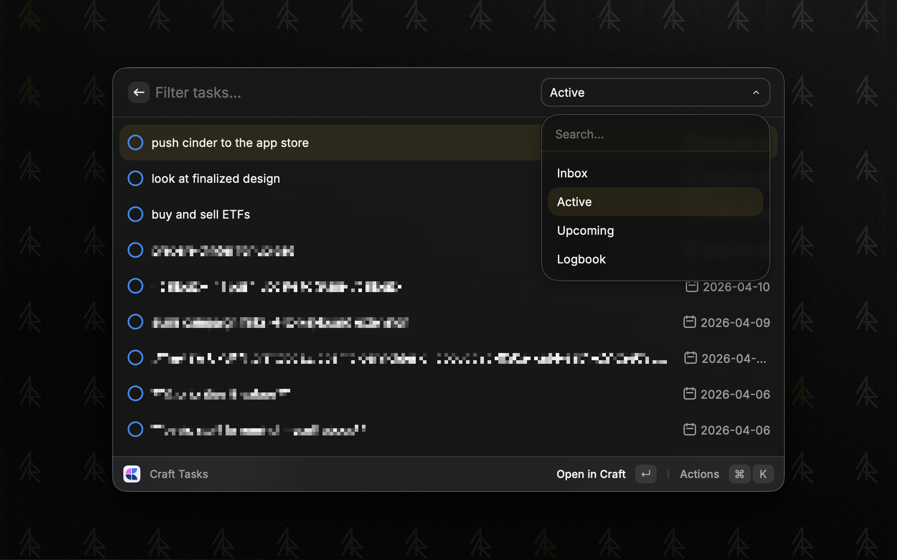
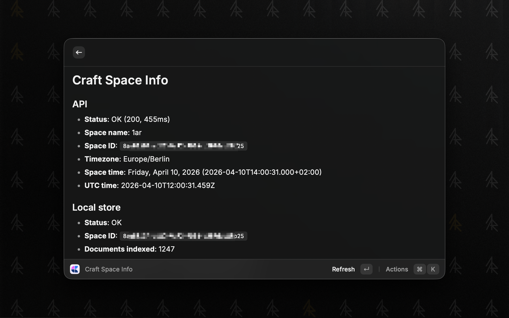

# Craft API - Raycast Extension

Fast Raycast interface to your [Craft Docs](https://www.craft.do/) vault. Hybrid architecture: reads from Craft's local SQLite FTS5 index and PlainTextSearch JSON files (instant), writes via the Craft "API for All Docs" (~1s).

Powered by [`@1ar/craft-cli`](https://github.com/pa1ar/craft-cli) for the API client layer, and bundles WASM SQLite for local reads.

## Screenshots

| Search Craft | Open Document |
|---|---|
|  |  |

| Craft Tasks | Craft Space Info |
|---|---|
|  |  |

[More screenshots](docs/screenshots/) - Recent Documents, Daily Notes, Browse Folders, Browse Collections, Create Document, Open Daily Note, Append to Daily Note, Add Task.

## Commands

| Command | Mode | Source | Description |
|---|---|---|---|
| **Search Craft** | view | local FTS5 | Full-text search across every block. Shows doc title + snippet + date |
| **Open Document** | view | local | Fuzzy filter all documents by title |
| **Recent Documents** | view | local | Documents modified in the last 14 days |
| **Daily Notes** | view | local | Browse all daily notes, sorted by date |
| **Open Daily Note** | no-view | local | Opens today's daily note. Arg: `today`/`yesterday`/`YYYY-MM-DD` |
| **Append to Daily Note** | no-view | API | Append a line to today's daily note |
| **Add Task to Inbox** | no-view | API | Quick task capture to Craft inbox |
| **Craft Tasks** | view | API | Browse and manage tasks by scope (inbox/active/upcoming/logbook) |
| **Create Craft Document** | no-view | API | Create a new document and open it in Craft |
| **Browse Folders** | view | API | Drill-down folder tree with documents |
| **Browse Collections** | view | API | List collections and their items |
| **Craft Space Info** | no-view | API | Show connected space name |

Each list item (search, recent, fuzzy-open, folders) supports: Open in Craft, Preview (markdown Detail), Show Backlinks, Copy Full Markdown, Copy Document ID.

## Hybrid reads architecture

Craft's macOS app maintains two local data stores that update within ~1 second of any API or in-app write:

- **SQLite FTS5 index** (`~/Library/Containers/com.lukilabs.lukiapp/.../Search/*.sqlite`) - flat plain-text blocks with full-text search
- **PlainTextSearch JSON** (`~/Library/Containers/com.lukilabs.lukiapp/.../PlainTextSearch/{spaceId}/document_{id}.json`) - one file per document with full markdown, tags, timestamps, contentHash

This extension reads both directly. No polling, no mirroring, no cache invalidation.

```mermaid
flowchart LR
    subgraph "READ - local, <10ms"
        direction TB
        R1[Search Craft] --> SQLite[(SQLite FTS5)]
        R2[Open/Recent/Daily Notes] --> SQLite
        R2 --> PTS[(PTS JSON)]
        R3[Preview / Copy Markdown] --> PTS
    end

    subgraph "WRITE - API, ~500ms"
        direction TB
        W1[Tasks CRUD] --> API[Craft REST API]
        W2[Create Document] --> API
        W3[Add Task / Append Daily] --> API
        W4[Folders / Collections browse] --> API
    end

    API -->|syncs ~1s| CraftApp[Craft app]
    CraftApp -->|derives| SQLite
    CraftApp -->|derives| PTS

    style SQLite fill:#1a3a1a,stroke:#4a8a4a
    style PTS fill:#1a3a1a,stroke:#4a8a4a
    style API fill:#3a1a1a,stroke:#8a4a4a
```



**Benchmarks** (vs pure API approach, 1,200-doc vault):

| Operation | API | Local | Speedup |
|---|---|---|---|
| Search vault | ~2,300ms | ~2ms | 1,100x |
| Read document content | ~4,500ms | ~3ms | 1,500x |
| List all documents | ~1,500ms | ~180ms | 8x |

Source: [craft-cli benchmarks](https://github.com/pa1ar/craft-cli/blob/main/docs/local-performance-results.md).

**Why API is still needed:** writes (create doc, add task, update task state), folder structure, collection schemas, task scheduling - none of this exists in the local stores. So the extension is split: reads go local when Craft is installed, writes + structural browsing go through the API.

**Fallback:** if Craft isn't installed (non-Mac, first-time use), all reads fall back to the API automatically.

## Setup

1. Install the extension in Raycast
2. Open preferences and paste your Craft API URL and key
3. First run will prompt for macOS permission to access Craft's container folder - click Allow

You need an "API for All Docs" connection from Craft. See [Craft API docs](https://developer.craft.do/).

The API credentials are only required for write operations and structural browsing (folders, collections, tasks). Search, preview, and opening documents work without API credentials as long as Craft is installed locally.

## Dev

```sh
cd ~/dev/raycast/craft-api
bun install
ray develop    # hot-reload into Raycast
ray build      # production build
ray lint       # validate manifest + lint
```

If you change craft-cli first:

```sh
cd ~/dev/tools/craft-cli && bun install && bun run build
cd ~/dev/raycast/craft-api && bun install
```

## Related repos

- [pa1ar/craft-cli](https://github.com/pa1ar/craft-cli) - API client, types, schema
- [raycast/extensions/craftdocs](https://github.com/raycast/extensions/tree/main/extensions/craftdocs) - the original Craft extension by @sfkmk (local reads only, different scope)

WASM SQLite assets (`assets/sql-wasm-fts5.*`) are borrowed from the original craftdocs extension.

## License

MIT
