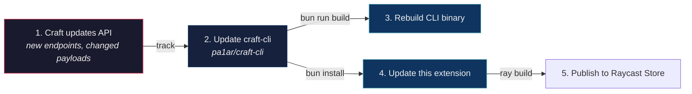

# Craft API - Raycast Extension

Search, open, and edit your [Craft Docs](https://www.craft.do/) vault from Raycast - powered by the Craft "API for All Docs".

Uses [`@1ar/craft-cli`](https://github.com/pa1ar/craft-cli) as a library (direct TypeScript import, no shell-outs).

## Commands

| Command | Mode | Description |
|---------|------|-------------|
| **Search Craft** | view | Full-vault regex search. Enter opens in Craft, Cmd+Enter copies markdown |
| **Open Daily Note** | no-view | Opens today's daily note deeplink. Arg: `yesterday`, `2026-04-01` |
| **Add Task to Inbox** | no-view | One-shot task capture to Craft inbox |
| **Append to Daily Note** | no-view | Quick append to today's daily note |
| **Recent Documents** | view | Last 14 days of modified documents |
| **Open Document** | view | Fuzzy filter the entire vault by title (5-min cache) |

## Setup

1. Install the extension in Raycast
2. Open preferences and paste your Craft API URL and key (stored in Raycast's secure store)

You need an "API for All Docs" connection from Craft. See [Craft API docs](https://developer.craft.do/).

## How updates propagate

When Craft updates their API, changes flow through in order:



- **Craft API** is the source of truth - we track their changelog and API docs
- **craft-cli** is where all API changes land first - types, client methods, error handling
- **This extension** and the Claude Code skill consume craft-cli. They never call the Craft API directly, so they only need updating when craft-cli's public interface changes

The library is linked via `"@1ar/craft-cli": "file:../../tools/craft-cli"` in package.json. After any craft-cli changes, run `bun install` here to pick them up.

## Dev

```sh
cd ~/dev/raycast/craft-api
bun install
ray develop
```

Rebuild craft-cli first if you changed it:

```sh
cd ~/dev/tools/craft-cli && bun install && bun run build
```

## Related repos

- [pa1ar/craft-cli](https://github.com/pa1ar/craft-cli) - the underlying CLI and library
- Craft API docs: `~/dev/craft-docs/craft-do-api/craft-do-api-docs.md`

## License

MIT
